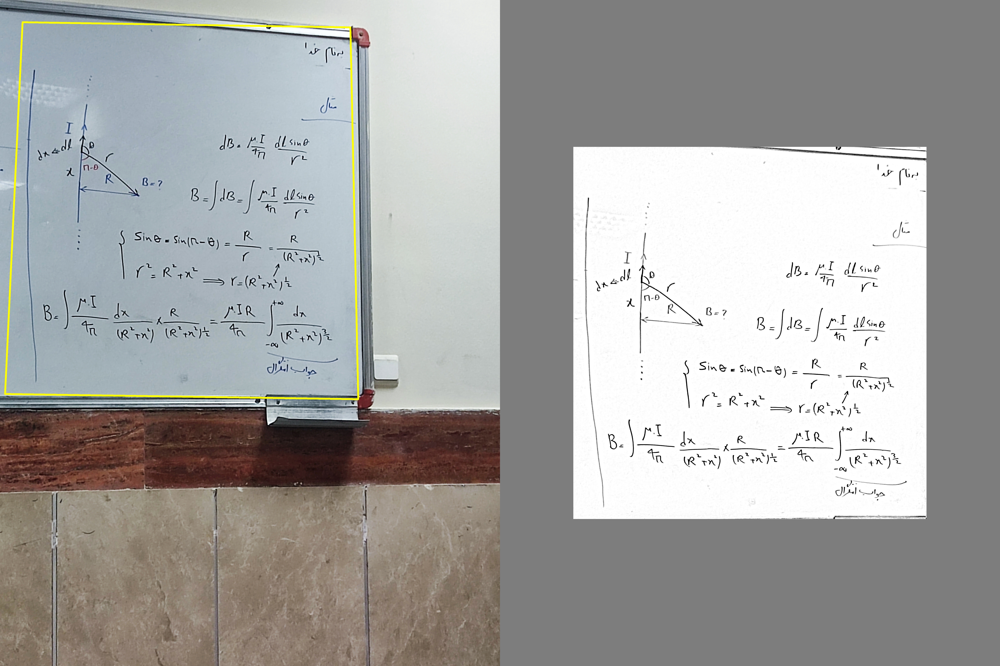

# Document Scanner :bookmark_tabs:
[U-Net](https://arxiv.org/abs/1505.04597v1) Like Pretrained Model For Scene Document Detection ([pytorch](https://pytorch.org/), [Semantic Segmentation](https://paperswithcode.com/task/semantic-segmentation))

#### **Quick Links**
- [Dependencies](#Dependencies)
- [Usage](#Usage)
- [Examples](#Examples)

## Dependencies
- Install Dependencies `$ pip install -r requirements.txt`
- Download model weights [Here](https://github.com/), place it in `Structure/`

## Usage:
```python
  scanner = Scanner("Structure/Scanner-Detector.pth", config_)
```
Load model.

```python
  org = cv2.imread(fname)
  org_gray = cv2.cvtColor(org, cv2.COLOR_RGB2GRAY)
  org_resize = cv2.resize(org_gray, (256, 256), interpolation = cv2.INTER_AREA)
```
Read image in gray scale and resize it to 256*256.

```python
  mask = scanner.ScanView(org_resize)
```
Detect document area.

```python
  paper, approx = ExtractPaper(org_gray, mask)
  org = DrawBox(org, approx)
```
Extract document and draw bounding box on original image.

```python
  paper = EnhacePaper(paper)
```
Enhance extracted document.

## Examples




### 🛡️ License <a name="license"></a>
Project is distributed under [MIT License](https://github.com/Saeed-Biabani/Document-Scanner/blob/main/LICENSE)
